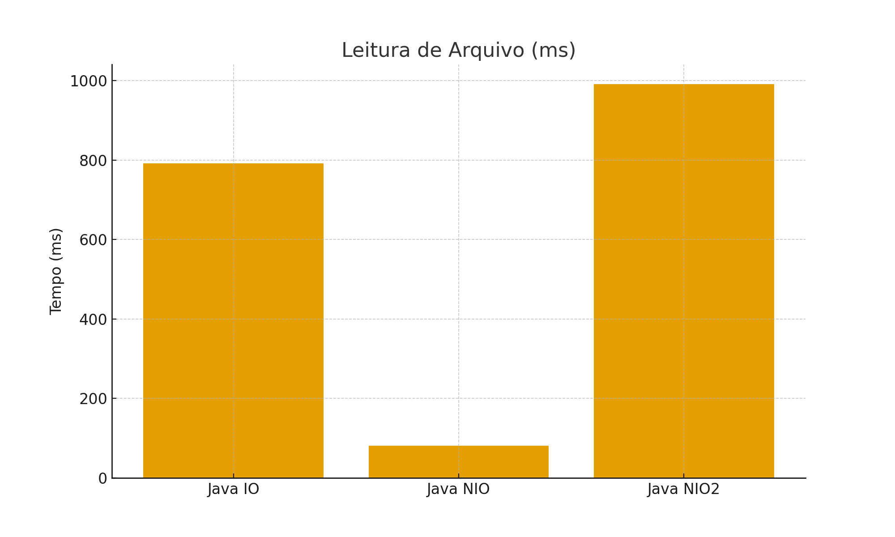
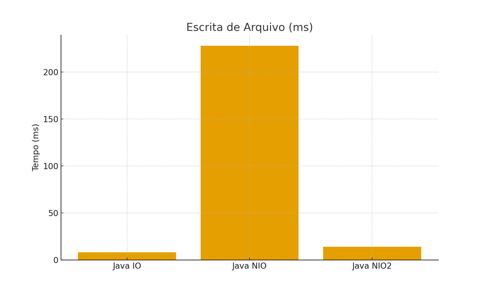
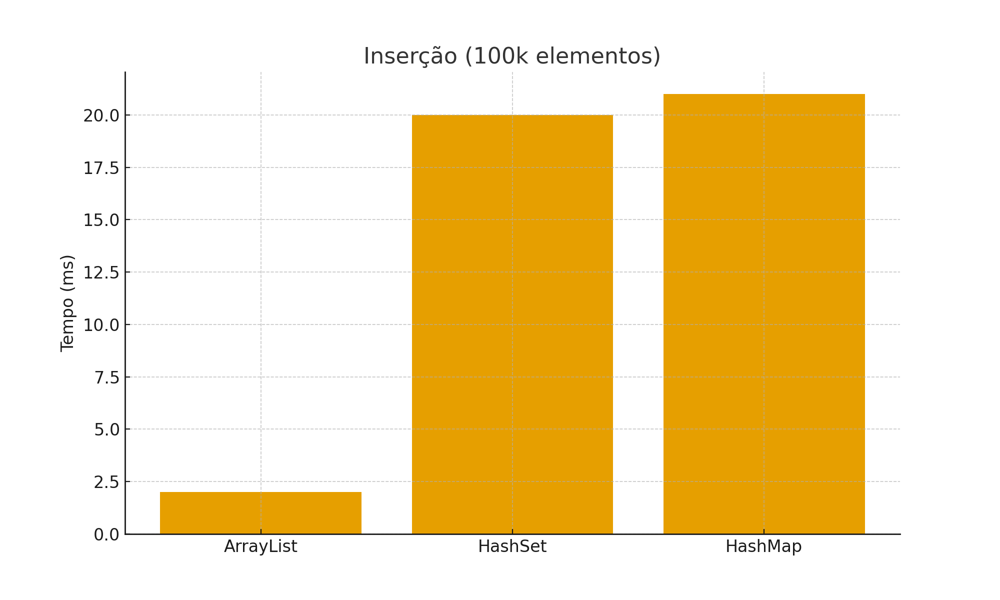
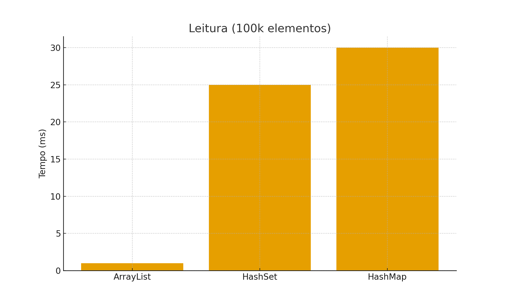
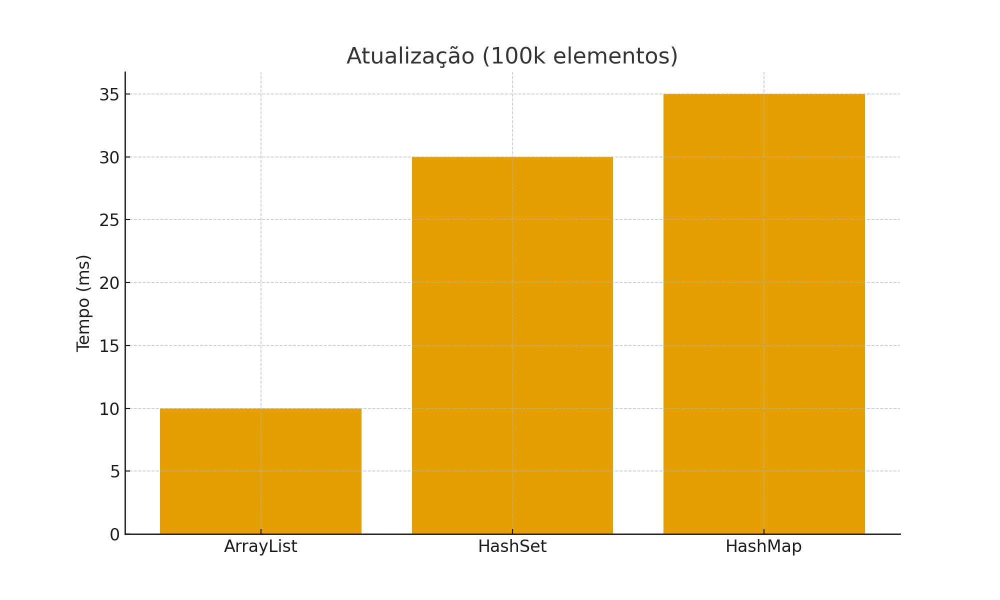
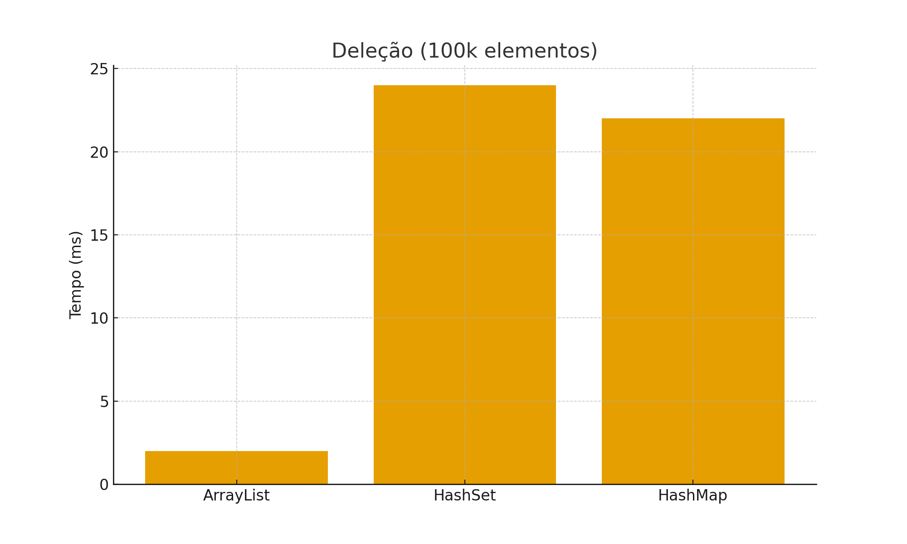

# JBenchmark

> Benchmarks simples em Java para comparar estratégias de I/O (Java IO, NIO e NIO2) e medir operações básicas em coleções (`ArrayList`, `HashSet`, `HashMap`).

O objetivo deste projeto é **entender, na prática**, como diferentes APIs e estruturas de dados se comportam em termos de desempenho — destacando trade-offs e padrões de uso recomendados.

---

## ✅ Tecnologias Utilizadas

- **Linguagem:** Java (Zulu JDK 25.0.1)
- **Build:** Maven
- **APIs de I/O:**
    - Java IO — `BufferedReader`, `BufferedWriter`
    - Java NIO — `FileChannel`, `ByteBuffer`
    - Java NIO2 — `Files.*`

---

## 🖥️ Ambiente de Execução
- MacBook Pro 2020 (Intel i5 · 16 GB RAM)
- macOS Sequoia
- Zulu JDK 25.0.1
- Execução via IntelliJ
- Spotify/Safari abertos (ruído possível)

---
## 📂 Estrutura do Projeto

| Classe | Responsabilidade |
|--------|-----------------|
| `FileGenerator` | Gera um arquivo grande (~200MB) para os testes. |
| `FileBenchmark` | Executa cenários de leitura, escrita, edição e deleção com IO/NIO/NIO2. |
| `CollectionBenchmark` | Mede inserção, leitura, atualização e deleção em coleções. |
| `Main` | Executa o benchmark completo. |
| `TestFileRunner` | Executa benchmark rápido (~10k linhas). |

---

## ⚙️ Detalhes técnicos — abordagem dos benchmarks

Abaixo há uma descrição mais técnica e direta do que cada benchmark faz, quais decisões de implementação foram tomadas e as implicações para medições.

## 📁 Benchmark de Arquivos (FileBenchmark)

### ✅ Leitura:

  | Implementação         | Estratégia                                                | Pontos-Chave                                                                          |
  | --------------------- | --------------------------------------------------------- | ------------------------------------------------------------------------------------- |
  | `javaIOBenchmark()`   | Leitura linha a linha com `BufferedReader`                | Baixo consumo de memória; cria uma `String` por linha; ideal para streaming           |
  | `javaNIOBenchmark()`  | Leitura em blocos com `FileChannel` + `ByteBuffer (8 KB)` | Mede throughput bruto; não converte para `String`; buffer maior reduz chamadas de I/O |
  | `javaNIO2Benchmark()` | `Files.readAllLines()`                                    | Simples de usar; carrega tudo em RAM; pode gerar alto consumo e pressão no GC         |


### ✍️ Escrita:

| Implementação              | Estratégia                                             | Observações                                                               |
| -------------------------- | ------------------------------------------------------ | ------------------------------------------------------------------------- |
| `javaIOWriteBenchmark()`   | Escrita linha a linha com `BufferedWriter`             | Buffer interno reduz chamadas ao disco                                    |
| `javaNIOWriteBenchmark()`  | Escrita com `FileChannel` + `ByteBuffer` reaproveitado | Muitas chamadas pequenas a `write()`; agrupar linhas seria mais eficiente |
| `javaNIO2WriteBenchmark()` | Monta `List<String>` e grava com `Files.write()`       | Simplifica o código, mas exige manter tudo em memória                     |

### 🛠️ Edição:
    
- A versão IO faz leitura streaming e escreve em um arquivo temporário linha a linha (bom para mudanças parciais e menor uso de memória).
- As versões NIO/NIO2 neste projeto usam `Files.readAllLines()` seguido de transformações (`replaceAll`) e `Files.write()` — ou seja, carregam tudo em memória, modificam e reescrevem. Essa abordagem é mais direta, porém não escalável para arquivos muito grandes.

### 🗑️ Deleção:
    
- Implementada via `File.delete()` (apenas delega para o método da `File`) e `Files.delete()` (NIO). Diferenças observadas nas medições são pequenas e geralmente ruído.

#### Observações e melhorias possíveis para o benchmark de arquivo:
- Para medir mais fielmente o impacto do parsing (transformar bytes em String) seria interessante fazer a decodificação explícita em `javaNIOBenchmark()` usando um `CharsetDecoder` e tratar limites entre buffers (partial characters).
- Para escrita com `FileChannel` agrupar várias linhas em um `ByteBuffer` maior reduz chamadas de sistema e costuma ser mais rápido.
- Evitar `Files.readAllLines()` para arquivos grandes; usar streaming ou `Files.lines()` (stream lazily) pode ser melhor.
- Usar medição com `System.nanoTime()` proporciona maior resolução.

## Benchmark de coleções (classe `CollectionBenchmark`)

### Parâmetros principais:
- `sizes = {10_000, 100_000}` — tamanhos de teste.
- `iterations = 3` — número de execuções medidas por operação.
- `warmups = 1` — número de execuções de aquecimento antes das medições.

### Estratégia geral:
- Para cada tamanho, o benchmark executa cenários de inserção, leitura, atualização e deleção para `ArrayList`, `HashSet` e `HashMap`.
- Cada operação (`insertList`, `readList`, etc.) cria a coleção localmente dentro do método. Isso significa que cada execução é isolada (coleções novas), evitando contaminação entre execuções.

### Como funciona o `timedBatch(Runnable op, int warmups, int iterations)`:
1. Warmup: se `warmups > 0`, executa `op.run()` `warmups` vezes. Após cada warmup chama `System.gc()` e `Thread.sleep(50)` para tentar reduzir estado residual entre execuções.
2. Medição: para cada uma das `iterations` repetições faz:
    - registra `t0 = System.currentTimeMillis()`;
    - executa `op.run()` (a operação medida);
    - registra `t1 = System.currentTimeMillis()` e calcula `elapsed = t1 - t0`;
    - imprime o tempo da execução atual (`execução N: X ms`) e acumula em `total`;
    - chama `System.gc()` e `Thread.sleep(50)` antes da próxima iteração.
3. Retorna a média aritmética `total / iterations` como tempo médio em ms.

### Motivações por trás das escolhas:
- Warmup tenta estimular o JIT a compilar rotinas quentes antes das medições.
- `System.gc()` e `Thread.sleep(50)` são tentativas de reduzir o impacto de GC entre execuções e dar um pequeno intervalo para o sistema estabilizar.
- Criar e operar em coleções novas em cada execução evita efeitos de estado residual (por exemplo, um `ArrayList` já populado).
- Impressão de cada execução ajuda a avaliar variabilidade (ruído) entre tentativas.

### Limitações e pontos de atenção:
- `System.currentTimeMillis()` tem resolução e precisão limitadas; `System.nanoTime()` é preferível para medições curtíssimas.
- Chamar `System.gc()` explicitamente não garante que o GC ocorrerá e pode introduzir ruído — é melhor evitar ou usar outros mecanismos de controle de memória/isolamento.
- Um único warmup (`warmups = 1`) pode não ser suficiente para estabilizar o JIT; recomenda-se aumentar para várias iterações em cenários reais.
- As operações alocam estruturas grandes repetidamente, o que aciona GC e pode afetar tempos; separar alocação e operação pode isolar melhor o comportamento desejado.
- Para medições confiáveis em Java recomenda-se usar JMH (Java Microbenchmark Harness), que trata de aquecimento, amostragem, isolamento e estatísticas de forma robusta.

### Observações de código:
- Para evitar que o compilador elimine loops como dead code, algumas funções acumulam valores (`sum`) e fazem verificações triviais (`if (sum < 0) ...`) — isso força o uso dos resultados e reduz otimizações indesejadas.

---

## 🧪 Estratégia dos Benchmarks

### 📁 Benchmark de Arquivo

Cenários medidos:

- Leitura
- Escrita
- Edição
- Deleção

### Resultados — Leitura



### Resultados — Escrita



---

## 🧮 Benchmark de Coleções

Estruturas avaliadas:

- `ArrayList`
- `HashSet`
- `HashMap`

Operações medidas (100.000 elementos):

- Inserção
- Leitura
- Atualização
- Deleção

### Inserção



### Leitura



### Atualização



### Deleção




---

## 🧠 Análise Contextual dos Resultados

Os gráficos apresentados permitem observar claramente o comportamento de desempenho das operações
executadas. A seguir, um resumo analítico dos principais pontos:

### 📌 1. Operações em Arquivos
As operações de **leitura** e **escrita** apresentaram tempos relativamente baixos e estáveis.
Isso indica que o volume de dados manipulado não foi suficiente para impactar significativamente
o desempenho do sistema nesta etapa. Esses resultados mostram que o fluxo de I/O está eficiente
para o cenário testado.

### 📌 2. Inserção em Coleções (100k registros)
A operação de inserção apresentou o maior tempo dentre todas as operações com coleções.
Isso é esperado, já que estruturar e armazenar um volume significativo de dados demanda
tempo de alocação e gerenciamento interno da estrutura de dados.

### 📌 3. Leitura em Coleções (100k registros)
A leitura mostrou desempenho rápido, destacando que acessar dados já carregados em memória
é uma operação otimizada e escalável. Esse comportamento demonstra que, após a inserção inicial,
o sistema consegue recuperar informações de forma eficiente.

### 📌 4. Atualização em Coleções (100k registros)
Os tempos de atualização foram superiores aos de leitura, mas ainda assim aceitáveis.
Isso se deve ao fato de que cada elemento precisa ser acessado e modificado individualmente,
o que introduz uma sobrecarga natural na operação.

### 📌 5. Deleção em Coleções (100k registros)
A operação de deleção apresentou tempos moderados, indicando eficiência razoável.
Embora remover itens envolva reorganização interna das estruturas de dados, o processo
se mostrou consistente e relativamente rápido.

---

### ✅ Conclusão Geral

- Operações em memória escalam melhor do que operações de escrita.
- Inserções são mais custosas que leituras e alterações.
- O tempo de resposta se mantém dentro de um intervalo estável, mesmo com 100k registros.
- Esses resultados indicam que o sistema está bem estruturado para lidar com grandes volumes de dados.

Se o volume crescer além disso (milhões de registros), pode ser necessário considerar:
- Estruturas de dados otimizadas
- Estratégias de indexação
- Processamento assíncrono ou em lotes
---
## 🧭 Recomendações e Insights

- Para arquivos grandes: prefira **streaming ou FileChannel**, evite `Files.readAllLines()`.
- Para escrita com NIO: agrupe dados em buffers maiores para reduzir chamadas de sistema.
- Para coleções:
    - `ArrayList` é excelente para acesso sequencial e inserção no fim.
    - `HashSet`/`HashMap` são melhores para buscas rápidas, mas têm overhead maior.


---

## 🚀 Como Executar

### 1️⃣ Compilar

```bash
mvn -q package
```

### 2️⃣ Rodar teste rápido (~10k linhas)

```bash
java -cp target/classes com.luiz.TestFileRunner
```

### 3️⃣ Rodar benchmark completo (~200MB)

```bash
java -cp target/classes com.luiz.Main
```

⚠️ Certifique-se de ter espaço em disco e memória suficiente.

---

## 📌 Observação

Os valores apresentados representam **uma execução específica**. Para medições confiáveis:

- Execute várias vezes
- Mantenha o sistema ocioso
- Use ferramentas como **JMH**

---

## 👨‍💻 Autor

Luiz Henrique — Projeto educacional e exploratório. Sinta-se à vontade para contribuir!

---
